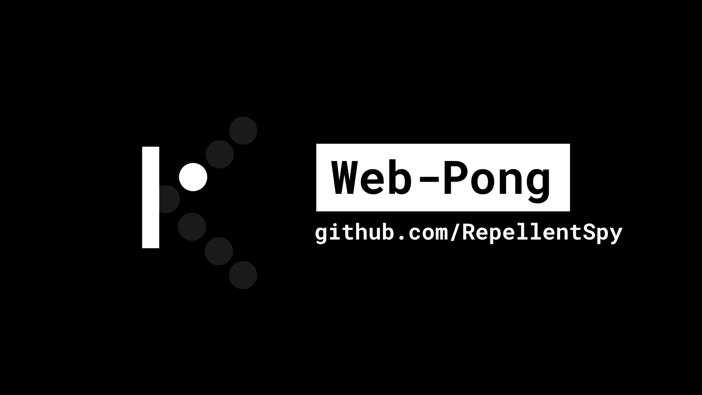

<h1>Web-Pong</h1>

A simple game of Pong for the internet. Entirely playable within a web browser that supports JavaScript.

<i>Part of <a href="https://hz-labs.web.app/">Honza's Labs</a></i>

# Functions
* Single player Pong where the player controls both paddles (player vs CPU coming soon)
* Speed of the ball increases when hit
* 2 player score counter system
* Intuitive user experience
* Retro look
* Smooth animations
* Dark mode

